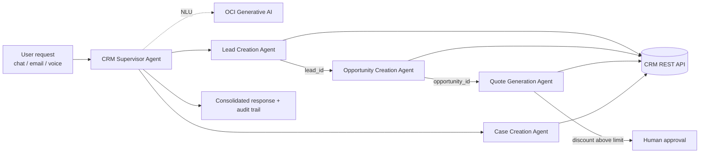

# CRM Workflow Agentic AI on OCI

> **Sanitized ACE project package.** All names, companies, email addresses, products, and prices in this repository are synthetic. It contains no credentials, tenancy details, OCIDs, production endpoints, or customer data.

## Overview

Sales and service teams describe work in plain language: *"New lead from the partner event, wants pricing for 25 Analytics Pro licenses, and their last invoice is wrong."* Turning that sentence into CRM records normally means four screens, several lookups, and manual pricing.

This project implements a **supervisor-agent pattern on OCI Functions**. A single supervisor function reads the natural-language request, extracts intents and entities, builds a dependency-aware action plan, and dispatches specialist agents that create the **lead**, **opportunity**, **quote**, and **service case**. IDs flow between agents (lead -> opportunity -> quote), business guardrails flag anything that needs a person, and the supervisor returns one consolidated, auditable response.

## Architecture

The full diagram is in [architecture.mmd](architecture.mmd).



## The five functions

| Function | Responsibility |
| --- | --- |
| `crm-supervisor-agent` | Validates the request, extracts intents and entities with OCI Generative AI (rule-based fallback), plans ordered steps with dependencies, invokes agents, links IDs between steps, applies a confidence threshold, aggregates review items and the audit trail. |
| `lead-creation-agent` | Validates contact data, scores the lead (budget, timeline, source, product interest), sets qualification (Sales Qualified / Nurture), and creates a de-duplication key. |
| `opportunity-creation-agent` | Links to the source lead, derives the sales stage and win probability, computes the expected close date and weighted revenue. |
| `quote-generation-agent` | Resolves products against the price catalog, applies volume tiers and requested discounts, enforces the auto-approval discount limit, and calculates tax, totals, and validity. |
| `case-creation-agent` | Classifies category and priority (P1-P4), computes the SLA response deadline, routes to a support queue, and records customer sentiment. |

## How the supervisor reasons

1. **Understand.** It extracts intents (`lead`, `opportunity`, `quote`, `case`) and entities (company, contact, email, budget, products and quantities, discount, timeline, source, urgency, issue description). With `GENAI_MODEL_ID` set, OCI Generative AI produces the plan as JSON. Otherwise, or if that call fails, a deterministic parser produces the same schema.
2. **Plan.** It builds ordered steps with explicit dependencies. A quote request with no opportunity automatically creates the opportunity first (*auto-quote*). A lead in the same request feeds the opportunity.
3. **Guard.** Empty or oversized requests are rejected. If no confident plan is possible, the request goes to `needs_human_review` and nothing is written.
4. **Dispatch.** It invokes each agent through `FunctionsInvokeClient`, passing the upstream `record_id` downstream. A failed dependency marks its dependents as `skipped` instead of creating orphan records.
5. **Report.** It returns record IDs, per-agent results, review items (e.g. discount approval, P1 notification), and an audit trail.

## Sample run (local dry run)

| Request | Outcome |
| --- | --- |
| New lead + opportunity + quote with 8% discount | Lead (score 88, Sales Qualified) -> Opportunity (Proposal, 70%) -> Quote 71,539.20 ready to send |
| Dashboard down for all users, urgent | P1 Technical case, 4-hour SLA, duty-manager flag |
| Quote for 3 products with 22% discount | Opportunity auto-created -> Quote 102,772.80 **Pending Approval** (limit 15%) |
| Partner-event lead wanting pricing + wrong invoice | Lead -> Opportunity -> Quote, plus P3 Billing case |
| "Can you check on the thing we discussed yesterday?" | `needs_human_review`, no records written |

Screenshots and the full JSON output are in [evidence/](evidence/).

## Repository layout

```text
CRM Workflow Agentic AI/
├── README.md
├── architecture.mmd
├── .gitignore
├── docs/
│   ├── ACE_SUBMISSION.md
│   └── EVIDENCE_CHECKLIST.md
├── sanitized-source/
│   ├── README.md
│   ├── crm-supervisor-agent/        func.py, func.yaml, requirements.txt
│   ├── lead-creation-agent/         func.py, func.yaml, requirements.txt
│   ├── opportunity-creation-agent/  func.py, func.yaml, requirements.txt
│   ├── quote-generation-agent/      func.py, func.yaml, requirements.txt
│   └── case-creation-agent/         func.py, func.yaml, requirements.txt
├── samples/
│   └── nlp-requests.json            five synthetic natural-language requests
├── local_runner/
│   └── run_demo.py                  end-to-end dry run, writes evidence/run-output/
├── tests/
│   └── test_workflow.py             13 unit tests (standard library only)
├── tools/
│   └── render_evidence.py           regenerates evidence screenshots
└── evidence/
    ├── README.md
    ├── 01-unit-tests-passing.png
    ├── 02-supervisor-nlp-dispatch.png
    ├── 03-lead-opportunity-quote-chain.png
    ├── 04-quote-discount-guardrail.png
    ├── 05-case-priority-sla.png
    └── run-output/                  CRM-DEMO-001..005.json
```

## Run locally

Requires Python 3.11. The workflow and tests use only the standard library. Pillow is needed only to regenerate screenshots.

```bash
python -m unittest discover -s tests -v   # 13 tests
python local_runner/run_demo.py           # runs samples/nlp-requests.json in dry-run mode
python tools/render_evidence.py           # optional: rebuild evidence/*.png
```

In local mode, no agent function OCIDs are set, so the supervisor loads the sibling agents in-process. `CRM_DRY_RUN=true` (the default) returns the prepared records with deterministic synthetic IDs instead of calling a CRM.

## OCI deployment

Deploy each folder in `sanitized-source/` as a function in one OCI Functions application (`fn deploy --app <app-name>`), then configure:

| Variable | Function | Purpose |
| --- | --- | --- |
| `LEAD_AGENT_FUNCTION_ID`, `OPPORTUNITY_AGENT_FUNCTION_ID`, `QUOTE_AGENT_FUNCTION_ID`, `CASE_AGENT_FUNCTION_ID` | supervisor | Agent functions to invoke |
| `FUNCTIONS_INVOKE_ENDPOINT` | supervisor | Functions invoke endpoint for the region |
| `GENAI_MODEL_ID`, `GENAI_COMPARTMENT_ID`, `GENAI_ENDPOINT` | supervisor | Enables OCI Generative AI planning |
| `MIN_PLAN_CONFIDENCE` | supervisor | Human-review threshold (default 0.6) |
| `CRM_DRY_RUN` | agents | Set `false` to write to the CRM |
| `CRM_BASE_URL`, `CRM_*_PATH` | agents | CRM REST endpoint and resource paths |
| `CRM_SECRET_OCID` | agents | OCI Vault secret that holds the CRM API token |
| `MAX_AUTO_DISCOUNT_PCT`, `QUOTE_TAX_RATE`, `CATALOG_JSON` | quote agent | Pricing policy and catalog |

Front the supervisor with OCI API Gateway. Use resource principals with a dynamic group whose policies allow only `use fn-invocation`, `use generative-ai-family`, and `read secret-bundles` on the specific secret.

## OCI services used

| Service | Role |
| --- | --- |
| OCI Functions | Supervisor and four specialist agents |
| OCI Generative AI | Intent and entity extraction into a structured action plan |
| OCI Vault | CRM API credentials, read at runtime via resource principal |
| OCI API Gateway | Authenticated HTTPS entry point for chat, email, and voice channels |
| OCI Logging | Function diagnostics and audit traceability |
| OCI IAM | Dynamic groups and least-privilege policies for resource principals |

## Author contribution

I designed and implemented this supervisor-agent CRM workflow: the natural-language planning layer with OCI Generative AI and a deterministic fallback, dependency-aware orchestration across OCI Functions, the lead-scoring, opportunity-staging, quote-pricing, and case-triage agents, the discount and confidence guardrails, and the dry-run test harness and evidence.
